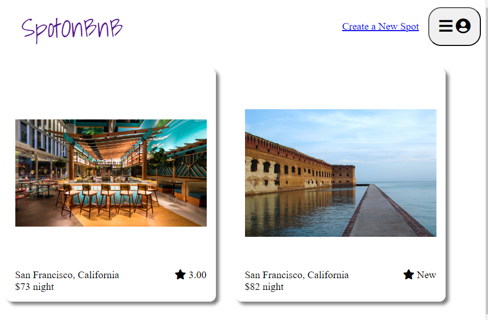

# Introdution
This website is a clone of airBnB. You can view all spots on the landing page. Clicking on each spot, you can view more details.
After log in, you can create/update/delete spots and create/delete reviews/rating.

# Technology

- React - An frontend library for building user interfaces.
- Redux - A predictable, centralized state container for JavaScript apps.
- Database - Development: SQlite3

# Screenshot of Project



# Setup

1. In the terminal, cd into the ```backend``` directory.
2. Install dependencies with ```npm install```.
3. Copy the ```.env.example``` file to a new file in the same location called ```.env```.
- The server should be listening for requests on port ```8000```.
- The SQLite3 database file should be ```db/dev.db```.
- Put in your own secret string for  ```JWT_SECRET``` and ```SCHEMA```
- Run
```npx dotenv sequelize-cli db:migrate``` - create the database and tables
- Run ```npx dotenv sequelize-cli db:seed:all``` - insert seed data
- Run ```npm start``` - start the backend server
4. In a different terminal, cd into the frontend directory of the starter.

- Run ```npm install``` in the ```frontend``` directory.
- Run ```npm start``` in the frontend directory to start the server.
Note that the package.json now defines a proxy of http://localhost:8000. This will effectively forward any unrecognized requests to the port (8000) on which your backend is listening.
Open http://localhost:3000 to see the frontend.
